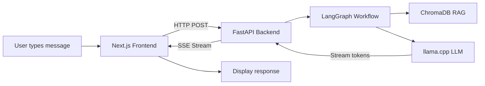

# AI Chat Application - Complete Beginner's Guide

This guide explains every file in the application and how they work together.

## How It Works (Big Picture)



---

## Backend Files Explained

### [config.py](file:///Users/mk/Desktop/workspace/ai-stuff/ai-app/backend/app/config.py)
**Purpose**: Central configuration for the entire app.

```python
class Settings(BaseSettings):
    model_path: str = "..."    # Where the LLM model file is
    n_ctx: int = 4096          # How much text the model can "remember"
    temperature: float = 0.7   # Creativity (0=focused, 1=creative)
```

- Uses `pydantic-settings` to load values from environment variables or `.env` file
- `@lru_cache()` ensures settings are only loaded once

---

### [schemas.py](file:///Users/mk/Desktop/workspace/ai-stuff/ai-app/backend/app/models/schemas.py)
**Purpose**: Defines data shapes (what data looks like).

```python
class ChatRequest(BaseModel):
    message: str        # User's message
    use_rag: bool       # Use knowledge base?

class ChatResponse(BaseModel):
    message: str        # AI's response
    conversation_id: str
```

- `BaseModel` from Pydantic validates data automatically
- If someone sends invalid data, FastAPI returns a clear error

---

### [llm_service.py](file:///Users/mk/Desktop/workspace/ai-stuff/ai-app/backend/app/services/llm_service.py)
**Purpose**: Loads and runs the local LLM (llama.cpp).

**Key parts:**
```python
# Load the model (happens once at startup)
self._llm = Llama(model_path="...", n_ctx=4096)

# Generate text (streaming)
async def generate_stream(self, prompt):
    for output in self._llm(prompt, stream=True):
        yield output["choices"][0]["text"]  # One token at a time
```

- Singleton pattern (`_instance`) ensures only one model is loaded
- Streaming lets us show text as it's generated, not all at once

---

### [rag_service.py](file:///Users/mk/Desktop/workspace/ai-stuff/ai-app/backend/app/services/rag_service.py)
**Purpose**: Stores and searches documents with ChromaDB.

**Key parts:**
```python
# Add a document
def add_document(self, content: str):
    embedding = self._embedder.encode(content)  # Text → numbers
    self._collection.add(embeddings=[embedding], documents=[content])

# Search for similar documents
def search(self, query: str):
    query_embedding = self._embedder.encode(query)
    results = self._collection.query(query_embeddings=[query_embedding])
```

- **Embeddings**: Convert text to numbers so we can find similar text
- **ChromaDB**: Vector database that finds similar documents fast

---

### [graph_service.py](file:///Users/mk/Desktop/workspace/ai-stuff/ai-app/backend/app/services/graph_service.py)
**Purpose**: Orchestrates the chat flow using LangGraph.

```python
# Define the workflow
workflow = StateGraph(ChatState)
workflow.add_node("retrieve", retrieve_context)  # Step 1: Get context
workflow.add_node("generate", generate_response)  # Step 2: Generate reply
workflow.set_entry_point("retrieve")
workflow.add_edge("retrieve", "generate")
```

- LangGraph defines a **graph** of steps
- Each node is a function that transforms the state
- Makes it easy to add more steps (e.g., fact-checking)

---

### [chat.py](file:///Users/mk/Desktop/workspace/ai-stuff/ai-app/backend/app/routers/chat.py)
**Purpose**: HTTP endpoints that the frontend calls.

**Key endpoints:**
```python
@router.post("/chat/stream")
async def chat_stream(request: ChatRequest):
    # Returns Server-Sent Events (SSE)
    return EventSourceResponse(stream_generator(...))
```

- **SSE (Server-Sent Events)**: One-way stream from server to client
- Frontend receives tokens one at a time as they're generated

---

### [main.py](file:///Users/mk/Desktop/workspace/ai-stuff/ai-app/backend/app/main.py)
**Purpose**: Application entry point - ties everything together.

```python
@asynccontextmanager
async def lifespan(app):
    # STARTUP: Load model and documents
    rag_service.initialize()
    document_loader.load_documents()
    llm_service.load_model()
    yield
    # SHUTDOWN: Cleanup
```

- **Lifespan**: Code that runs when app starts/stops
- **CORS**: Allows frontend (different port) to call the API

---

## Frontend Files Explained

### [useChat.ts](file:///Users/mk/Desktop/workspace/ai-stuff/ai-app/frontend/src/hooks/useChat.ts)
**Purpose**: React hook for chat with streaming.

```typescript
// Send message and handle streaming response
const response = await fetch("/api/chat/stream", { ... });
const reader = response.body.getReader();

while (true) {
    const { done, value } = await reader.read();
    // Parse SSE events, update message with each token
}
```

- Uses `fetch` with streaming to read tokens as they arrive
- Updates React state for each token → UI shows typing effect

---

### [page.tsx](file:///Users/mk/Desktop/workspace/ai-stuff/ai-app/frontend/src/app/page.tsx)
**Purpose**: Main chat page component.

```tsx
const { messages, sendMessage, isLoading } = useChat();

return (
    <MessageList messages={messages} />
    <ChatInput onSend={sendMessage} />
);
```

- Uses the `useChat` hook to manage chat state
- Passes data down to child components

---

## End-to-End Flow

1. **User types "What is Dell NativeEdge?"** and clicks send
2. **Frontend** (`useChat.ts`) sends POST to `/api/chat/stream`
3. **Backend router** (`chat.py`) receives the request
4. **LangGraph** (`graph_service.py`) runs the workflow:
   - **Retrieve node**: Searches ChromaDB for relevant docs
   - **Generate node**: Sends prompt + context to LLM
5. **LLM** (`llm_service.py`) generates tokens one at a time
6. **SSE stream** sends each token back to frontend
7. **Frontend** updates the UI with each token (typing effect)

---

## Quick Fix for PDF Loading

Your PDFs need the `cryptography` package. Run:

```bash
pip install cryptography
rm data/.loaded_docs  # Force reload
uvicorn app.main:app --reload
```
